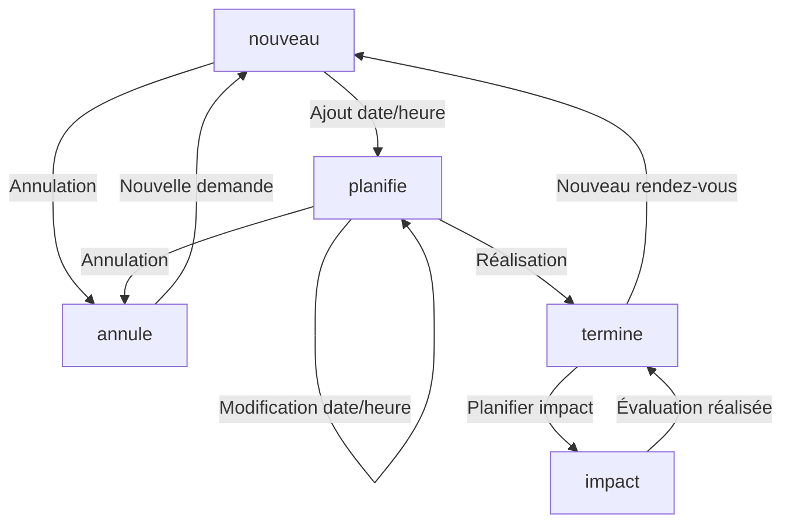
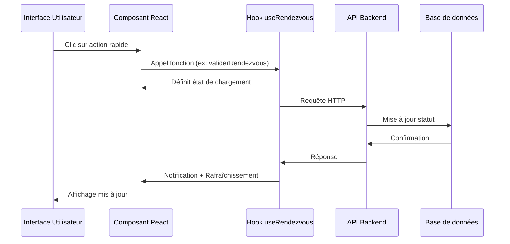

# Workflow des Rendez-vous et Demandes de Positionnement

## Vue d'ensemble

Le système gère un cycle de vie unique pour les rendez-vous de positionnement, depuis la demande initiale jusqu'à la finalisation. Chaque rendez-vous traverse plusieurs statuts qui déterminent les actions possibles et son affichage dans l'interface.

## Actions rapides disponibles

L'interface utilisateur propose des actions rapides adaptées au statut du rendez-vous, permettant une gestion efficace sans avoir à naviguer entre plusieurs écrans.

### Pour les rendez-vous avec statut "nouveau"

| Action | Description | Comportement technique |
|--------|-------------|------------------------|
| **Valider en un clic** | Valide rapidement la demande en la transformant en rendez-vous planifié avec le mode visio par défaut | Change le statut vers `planifie` et définit le canal sur `visio` |
| **Reprogrammer** | Ouvre une modale permettant de sélectionner une date/heure et un canal de communication | Change le statut vers `planifie` après saisie des informations |
| **Annuler RDV** | Annule la demande de rendez-vous | Change le statut vers `annule` |

### Pour les rendez-vous avec statut "planifie"

| Action | Description | Comportement technique |
|--------|-------------|------------------------|
| **Modifier** | Permet d'éditer les détails du rendez-vous | Ouvre le formulaire d'édition |
| **Traiter demande** | Permet d'accéder au workflow complet de traitement | Ouvre l'interface de workflow |
| **Annuler RDV** | Annule le rendez-vous planifié | Change le statut vers `annule` |

### Pour les rendez-vous avec statut "termine"

| Action | Description | Comportement technique |
|--------|-------------|------------------------|
| **Planifier impact** | Planifie un rendez-vous d'évaluation d'impact à 6 mois | Crée un nouveau rendez-vous avec statut `impact` |
| **Générer documents** | Permet de générer les documents de fin de formation | Génère et propose le téléchargement des documents |

### Pour les rendez-vous avec statut "impact"

| Action | Description | Comportement technique |
|--------|-------------|------------------------|
| **Compléter évaluation** | Permet de remplir le questionnaire d'évaluation d'impact | Ouvre le formulaire d'évaluation |
| **Générer rapport** | Génère un rapport d'impact basé sur l'évaluation | Produit un PDF avec les métriques d'impact |

### Retour utilisateur

Chaque action rapide inclut :
- Un indicateur de chargement pendant le traitement
- Une notification de succès ou d'erreur
- Le rafraîchissement automatique de la liste après l'action.

## Statuts des rendez-vous

| Statut | Description | Actions possibles |
|--------|-------------|-------------------|
| `nouveau` | Demande initiale reçue via le formulaire, sans date/heure fixée | Planifier, Annuler |
| `planifie` | Rendez-vous avec une date/heure définie | Reprogrammer, Marquer comme terminé, Annuler |
| `termine` | Rendez-vous ayant eu lieu | Créer un suivi, Générer documents, Planifier impact |
| `impact` | Rendez-vous d'évaluation d'impact 6 mois après formation | Évaluer, Générer rapport, Terminer |
| `annule` | Rendez-vous annulé par l'un des participants | Créer une nouvelle demande |

## Transitions de statut autorisées



## Champs requis par statut

### Statut: nouveau
- Informations bénéficiaire (nom, prénom, email, téléphone)
- Objectifs de formation
- Formation sélectionnée (optionnel)
- Informations entreprise (optionnel)
- Situation handicap (optionnel)
- Besoin financement (optionnel)

### Statut: planifie
- Tous les champs du statut "nouveau"
- Date et heure du rendez-vous (obligatoire)
- Canal du rendez-vous (visio, présentiel, téléphone)

### Statut: termine
- Tous les champs du statut "planifie"
- Synthèse du rendez-vous (obligatoire)
- Documents associés (optionnel)
- Date prévue pour le rendez-vous d'impact (calculée automatiquement à +6 mois)

### Statut: impact
- Tous les champs du statut "termine"
- Date du rendez-vous d'impact (obligatoire)
- Questionnaire d'évaluation d'impact (obligatoire)
- Niveau de satisfaction post-formation (obligatoire)
- Commentaires et retours sur l'application des compétences (optionnel)

## Rôles et responsabilités

### Administrateur / Formateur
- Peut voir toutes les demandes
- Peut planifier/modifier/annuler des rendez-vous
- Peut rédiger des synthèses et générer des documents

### Bénéficiaire
- Peut soumettre une demande initiale
- Reçoit les confirmations par email
- Peut demander une annulation (à implémenter)

## Alertes et rappels

- Email automatique à la création d'une demande
- Email de confirmation à la planification d'un rendez-vous
- Notification dans l'interface après chaque action (succès/erreur)
- Rappel 24h avant le rendez-vous (à implémenter)
- Notification post-rendez-vous pour remplir la synthèse (à implémenter)
- Alerte pour planifier le rendez-vous d'impact à 5 mois après la fin de formation
- Rappel 2 semaines avant la date prévue du rendez-vous d'impact

## Bonnes pratiques pour le développement

### 1. Gestion des états de chargement

Chaque action sur un rendez-vous doit:
- Afficher un indicateur de chargement pendant le traitement
- Désactiver les boutons concernés pour éviter les doubles clics
- Afficher clairement le résultat (succès/erreur)

```tsx
// Exemple de gestion d'état de chargement
const [loadingActions, setLoadingActions] = useState<Record<string, boolean>>({});

const handleAction = async (id) => {
  try {
    setLoadingActions(prev => ({ ...prev, [`action-${id}`]: true }));
    await performAction(id);
    await refreshData();
    showSuccessMessage();
  } catch (error) {
    showErrorMessage(error);
  } finally {
    setLoadingActions(prev => ({ ...prev, [`action-${id}`]: false }));
  }
};
```

### 2. Validation des transitions

Toutes les transitions de statut doivent être validées à la fois côté frontend et backend:

```javascript
// Exemple de validation backend
const validateStatusTransition = (currentStatus, newStatus) => {
  const validTransitions = {
    'nouveau': ['planifie', 'annule'],
    'planifie': ['termine', 'annule'],
    'termine': ['impact'],
    'impact': ['termine'],
    'annule': []
  };
  
  return validTransitions[currentStatus]?.includes(newStatus) || false;
};
```

## Intégration dans l'application

### Backend
- Modèle Prisma `Rendezvous` avec champ `statut` et `dateRdv`
- Contrôleur `/api/rendezvous` pour les opérations CRUD
- Routes spécifiques pour les transitions de statut:
  - `PUT /api/rendezvous/:id` - Mise à jour complète d'un rendez-vous
  - `PATCH /api/rendezvous/:id/statut` - Mise à jour uniquement du statut

### Frontend
- Composant `RendezvousFormUnified` pour création/modification
- Composant `RendezvousListUnified` pour l'affichage filtrable par statut
- Hook personnalisé `useRendezvous` pour la gestion d'état et des appels API
- Filtrage visuel par couleur selon le statut:
  - `nouveau` - Bleu
  - `planifie` - Vert
  - `termine` - Gris
  - `impact` - Violet
  - `annule` - Rouge

### Flux de données


